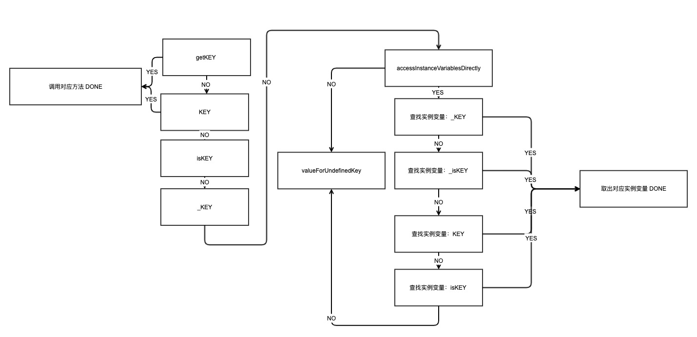

title: "KVC 探究，初级入门 "
date: 2020-02-24
tags: [KVC]
categories: [iOS基础知识]
keywords: KVC
description: 学习 KVC 底层处理流程。

<!--此处开始正文-->

## What is it?

**键值编码(Key-value coding)**。

* `[setValue:@"pmst" forKey:@"name"]`
* `[valueForKey:@"name"]`

runtime 底层有一套自己的处理流程，按照一定规则查找getter/setter方法或实例变量进行赋值。

以 `[object setValue:@"pmst" forKey:KEY]` 为例：

* 首先找到 object 中是否存在如下两个 setter 方法：setKEY 和 _setKEY，优先调用前者，后者次之；
* 如果两个都不存在，则调用 `accessInstanceVariablesDirectly` 类方法，明确是否可以访问实例变量，如果返回 NO 表明不允许，调用 `setValue:forUndefinedKey:` 并抛出异常；
* 如果返回 YES，那么开始查找对象中的实例变量，规则是：`_KEY，_isKEY, KEY, isKEY` 四种命名规则的实例变量，按顺序匹配，只要找到一个就停止。


`[valueForKey:@"name"]` 则稍有不同，主要体现在 getter 方法会比前者多几个：

* 首先找到 object 中是否存在如下两个 setter 方法：`getKEY / KEY / isKEY/ _KEY` ；
* 如果两个都不存在，则调用 `accessInstanceVariablesDirectly` 类方法，明确是否可以访问实例变量，如果返回 NO 表明不允许，调用 `valueForUndefinedKey:` 并抛出异常;
* 如果返回 YES，那么开始查找对象中的实例变量，规则是：`_KEY，_isKEY, KEY, isKEY` 四种命名规则的实例变量，这个和上面倒是一致的；



## How to use?

KVC 放置崩溃就是重写上面抛出异常的方法：

```objective-c
- (void)setValue:(id)value forUndefinedKey:(NSString *)key {
    NSLog(@"来了");
}
- (id)valueForUndefinedKey:(NSString *)key {
    return nil;
}
//MARK: 空置防崩溃
- (void)setNilValueForKey:(NSString *)key{
    NSLog(@"设置 %@ 是空值",key);
}
//MARK: - 键值验证 - 容错 - 派发 - 消息转发
- (BOOL)validateValue:(inout id  _Nullable __autoreleasing *)ioValue forKey:(NSString *)inKey error:(out NSError *__autoreleasing  _Nullable *)outError{
    if([inKey isEqualToString:@"name"]){
        [self setValue:[NSString stringWithFormat:@"里面修改一下: %@",*ioValue] forKey:inKey];
        return YES;
    }
    *outError = [[NSError alloc]initWithDomain:[NSString stringWithFormat:@"%@ 不是 %@ 的属性",inKey,self] code:10088 userInfo:nil];
    return NO;
}
```

对象属性赋值本质最终调用了 `reallySetProperty`，这里有个疑问，注意到 newValue 都是对象，对于 assign 的属性赋值应该不是这个吧。

```objective-c
// atomic、copy 修饰的属性
void objc_setProperty_atomic_copy(id self, SEL _cmd, id newValue, ptrdiff_t offset)
{
    reallySetProperty(self, _cmd, newValue, offset, true, true, false);
}
// nonatomic、copy 修饰的属性
void objc_setProperty_nonatomic_copy(id self, SEL _cmd, id newValue, ptrdiff_t offset)
{
    reallySetProperty(self, _cmd, newValue, offset, false, true, false);
}
// 省略了一些其他属性修饰符的属性，大致和上面差不多

static inline void reallySetProperty(id self, SEL _cmd, id newValue, ptrdiff_t offset, bool atomic, bool copy, bool mutableCopy)
{
    if (offset == 0) {
        // 调用 changeIsa(Class newCls) 改变 isa 指向的 newValue
        object_setClass(self, newValue);
        return;
    }

    id oldValue;
    id *slot = (id*) ((char*)self + offset);

    if (copy) {
        // 浅拷贝
        newValue = [newValue copyWithZone:nil];
    } else if (mutableCopy) {
        // 深拷贝
        newValue = [newValue mutableCopyWithZone:nil];
    } else {
        if (*slot == newValue) return;
        // 引用计数加 1
        newValue = objc_retain(newValue);
    }

    if (!atomic) {
        oldValue = *slot;
        *slot = newValue;
    } else {
        spinlock_t& slotlock = PropertyLocks[slot];
        slotlock.lock();
        oldValue = *slot;
        *slot = newValue;        
        slotlock.unlock();
    }
    // 释放旧值
    objc_release(oldValue);
}
```


## Why like this?

## Summary

## Reference
