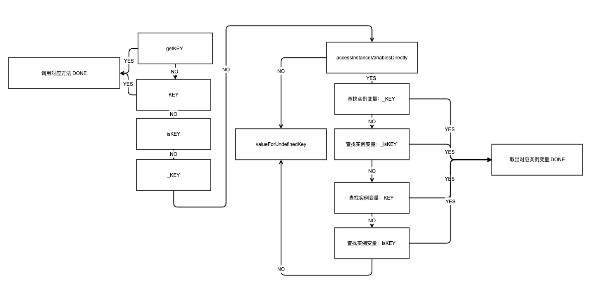
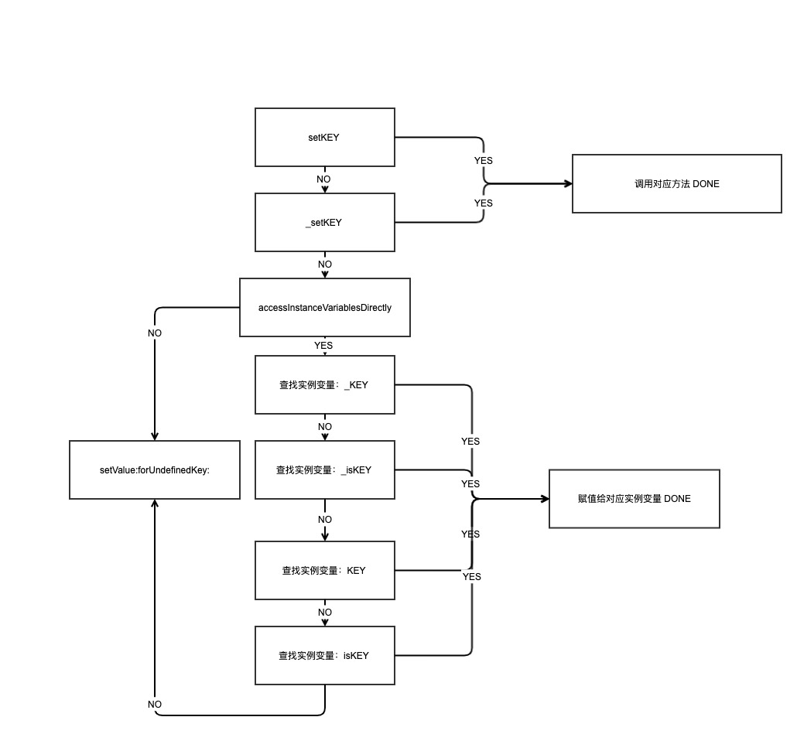
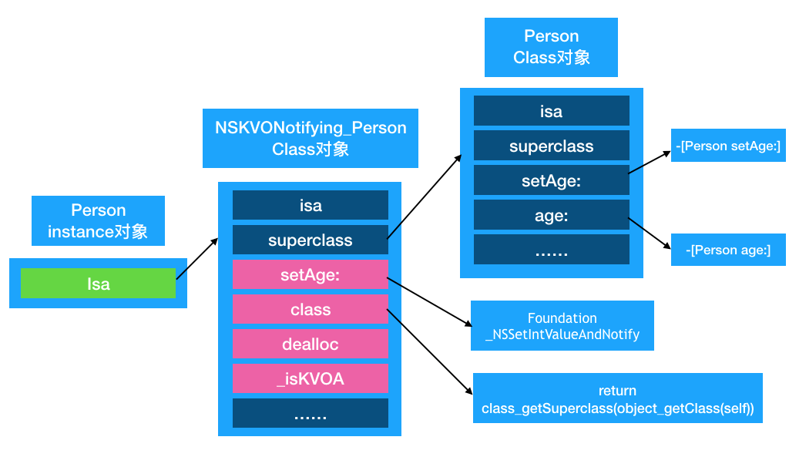
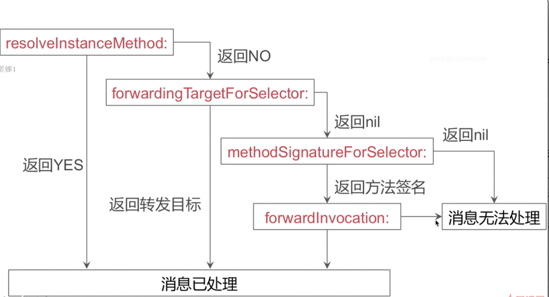

1. 讲一下内存管理的关键字？strong 和 copy 的区别

   strong 是对指向对象引用计数+1操作，copy 则是进行拷贝操作，引用计数等于1；

2. NSString 用什么关键字？为什么

   用 copy 关键字，倘若某个 `NSMutableString` 对象赋值给 `NSString` 对象，然后在某个时刻，前者进行了 append，或者其他操作，都会引起指向对象内容变化

3. 深拷贝和浅拷贝

   浅拷贝就是指针拷贝，深copy就是另外分配一块内存，然后将原对象内容赋值到该内存上。

   不可变数组 copy 是浅拷贝，mutablecopy是深拷贝；可变数组 copy 和 mutablecopy 都是深拷贝；copy 方法返回的都是不可变对象；

   完全深copy 和单层深copy，数组可以使用 `- (instancetype)initWithArray:(NSArray<ObjectType> *)array copyItems:(BOOL)flag;` 进行完全深拷贝；

4. NSString使用copy关键字，内部是怎么实现的？string本身会copy吗？

   NSString 使用 copy 是进行了浅拷贝（指针拷贝），不会重新生成一个新的对象。因为原来的对象是不能修改的, 拷贝出来的对象也是不能修改的,既然两个都不能修改, 所以永远不能影响到另外一个对象,已经符合拷贝的目的 。所以，OC为了对内存进行优化, 就不会生成一个新的对象

5. 使用NSArray 保存weak对象，会有什么问题？

   NSArray  addObject 一个 weak 对象，内部会对weak对象进行 `retaincount +1` 操作，导致非预期情况发生。

   那么有时候，我们想将对象存储起来,但是不想让数组增加了这个对象的引用计数,这个时候，NSPointArray才是你想要的

   ```objective-c
   @property (nonatomic, strong) NSPointerArray  *pointerArray;
   
   self.pointerArray = [NSPointerArray weakObjectsPointerArray];
   
   - (void)addObject:(id)object {
       [self.pointerArray addPointer:(__bridge void *)(object)];
   }
    
   - (id)objectAtWeakMutableArrayIndex:(NSUInteger)index {
       return [self.pointerArray pointerAtIndex:index];
   }
   ```

   方法二：万事加一层，同样可以解决这个问题，比如搞一个 WeakObject 类，内部用 weak 属性封装，但是这种做法还是无法避免数组持有这个 weakObject 的问题。

   方法三：不想自己搞封装类，就是用 `+ (NSValue )valueWithPointer:(nullable const void *)pointer` 现有类；

6. 有没有用过MRC？怎么用MRC？

   `retain release autorelease, free/malloc/memset, CFRelease/CFRetain`

   规则：

   * **自己生成的对象，自己所持有， 用alloc/new/copy/mutablecopy 名称开头的方法创建的对象。**—>生成对象并持有所有权。
   * **非自己生成的对象，自己也能持有。用retain方法持有对象。一个对象可以被多个人持有** –>获取对象的所有权

   用`alloc/new/copy/mutablecopy` 名称以外开头的方法创建的对象，属于非自己生成并持有的对象。

   通过`alloc/new/copy/mutablecopy` 名称开头的方法创建的对象表示自己生成的对象自己所持有，这里不需要进行retain操作，ps: alloc 时候引用计数并未+1操作，但是返回+1，这个和底层retaincount设置了默认值有关系。

   ```objective-c
   - (id)allocObject
   {
     id obj = [[NSObject alloc]init];
     return obj;
   }
   
   // 这种外面必须retain操作，内部使用autorelease pool
   - (id)Object
   {
     id obj = [[NSObject alloc]init];
     [obj autorelease];
     return obj;
   }
   ```

   **在MRC情况下：**

   1. **如果一个方法以init或者copy开头，那么返回给你的对象的引用计数是1，并且这不是一个autorelease的对象。换句话说，你调用这些方法的话，你就对返回的对象负责，你再用完之后必须手动调用release来释放内存。**
   2. **如果一个方法不是以init或者copy开头的话,那么返回的对象引用计数为1，但是，这是一个autorelease对象。换句话说，你现在可以放心使用此对象，用完之后它会自动释放内存。但是，如果你想在其它地方使用它（比如换个函数），那么，这时，你就需要手动retain它了。（记得用完release）。**

   更多请点击[ARC/MRC使用一文](http://m6830098.github.io/2015/12/24/ARC-MRC使用/)。

7. MRC和ARC的区别？

   ARC 是 LLVM 和 Runtime 协作的结果，ARC 中禁止调用 retain/release/retainCount/dealloc方法，新增weak strong。MRC 是手动管理内存。

   简单地说，就是代码中自动加入了retain/release，原先需要手动添加的用来处理内存管理的引用计数的代码可以自动地由编译器完成了。ARC并不是GC，它只是一种代码静态分析（Static Analyzer）工具.比如如果不是 alloc/new/copy/mutableCopy 开头的函数，编译器会将生成的对象自动放入 autoReleasePool 中。如果是 __strong 修饰的变量，编译器会自动给其加上所有权。等等，详细，我们根据不同的关键字来看看编译器为我们具体做了什么。并从中总结出 ARC 的使用规则。

8. weak修饰的属性释放后会被变成nil，怎么实现的？

   全局的 SideTables，通过key-value，用指针获取到对应的SideTable，引用计数和weak表

   ```objective-c
   struct SideTable {
       spinlock_t slock;
       RefcountMap refcnts;
       weak_table_t weak_table;
   }
   
   struct weak_table_t {
       weak_entry_t *weak_entries;
       size_t    num_entries;
       uintptr_t mask;
       uintptr_t max_hash_displacement;
   };
   ```

   做成不同的SideTable，是为了提升效率，涉及到资源竞争，所以加锁，但是加锁又很耗时，如果只有一个全局表，那么不同线程都访问的话，效率极低，而现在就ok拉。

   `weak_entries` 保存了指向某个实例对象的 weak objects，因为存储的是 `referrers`，说白了就是指针的指针，在 dealloc 的时候会被置为 nil。

   ```objective-c
   // 1
   _objc_rootDealloc 
   
   // 2
   obj->rootDealloc() 
   
   // 3
   inline void
   objc_object::rootDealloc()
   {
       if (isTaggedPointer()) return;  // fixme necessary?
   
       if (fastpath(isa.nonpointer  &&  
                    !isa.weakly_referenced  &&  
                    !isa.has_assoc  &&  
                    !isa.has_cxx_dtor  &&  
                    !isa.has_sidetable_rc))
       {
           assert(!sidetable_present());
           free(this);
       } 
       else {
           object_dispose((id)this);
       }
   }
   
   // 4
   id 
   object_dispose(id obj)
   {
       if (!obj) return nil;
   
       objc_destructInstance(obj);    
       free(obj);
   
       return nil;
   }
   
   // 5
   void *objc_destructInstance(id obj) 
   {
       if (obj) {
           // Read all of the flags at once for performance.
           bool cxx = obj->hasCxxDtor();
           bool assoc = obj->hasAssociatedObjects();
   
           // This order is important.
           if (cxx) object_cxxDestruct(obj);
           if (assoc) _object_remove_assocations(obj);
           obj->clearDeallocating();
       }
   
       return obj;
   }
   
   // 6 
   inline void 
   objc_object::clearDeallocating()
   {
       if (slowpath(!isa.nonpointer)) {
           // Slow path for raw pointer isa.
           sidetable_clearDeallocating();
       }
       else if (slowpath(isa.weakly_referenced  ||  isa.has_sidetable_rc)) {
           // Slow path for non-pointer isa with weak refs and/or side table data.
           clearDeallocating_slow();
       }
   
       assert(!sidetable_present());
   }
   
   // 7
   void 
   objc_object::sidetable_clearDeallocating()
   {
       SideTable& table = SideTables()[this];
   
       // clear any weak table items
       // clear extra retain count and deallocating bit
       // (fixme warn or abort if extra retain count == 0 ?)
       table.lock();
       RefcountMap::iterator it = table.refcnts.find(this);
       if (it != table.refcnts.end()) {
           if (it->second & SIDE_TABLE_WEAKLY_REFERENCED) {
               weak_clear_no_lock(&table.weak_table, (id)this);
           }
           table.refcnts.erase(it);
       }
       table.unlock();
   }
   ```

   真的够深入。

9. KVC平时怎么用的？举个例子

   我绘制了关于取值和赋值时候的流程，便于理解 KVC 的规则
   

   
   > Key-Value-Coding
   > KVC便指不通过setter和getter方法来获取实例变量的值，而是用实例变量的名字来获取值.
   > KVC不仅能代替setter和getter方法,还能无视readonly标记的属性。
   > 如果这个属性是有同名实例变量,并且它是readonly，那么KVC即可无视只读，来实现修改该属性

   ```objective-c
   // 设置值
   [obj setValue:value forKey:@"key"];
   [obj setValue:value forKeyPath:@"key.subKey.subSubKey"];
   
   // 取值
   [obj valueForKey:@"key"];
   [obj valueForKeyPath:@"key.subKey.subSubKey"];//如果subKey对应是一个对象,该方法可以获取改对象的subSubKey的值
   [obj valueForKey:@"key.subKey"];//如果keys是一个数组,该方法可以提取数组中每一个成员的subKey的值合成一个新的数组返回出来
   
   // 公式计算
   [obj valueForKeyPath:@"key.@sum.valueKey"];//如果keys是一个数组,则提取所有valueKey的值加起来返回.
   
   [obj valueForKeyPath:@"key.@avg.valueKey"];//如果keys是一个数组,则提取所有valueKey的值取平均值返回.
   ```


10. KVC一定能修改readonly的变量吗？

    按照上面流程图实际上就可以知道一旦这个设置为NO，则无法直接修改实例变量了

    ```objective-c
    + (BOOL)accessInstanceVariablesDirectly {
        return NO;
    }
    ```

    如果想要修改 readonly 的值，其实也可以通过runtime 方法获取 ivar 实例变量数据结构，然后修改对应内存值。

11. KVC还有哪些用法？

    见上

12. keyPath怎么用的？

    见上。

13. KVO的实现原理？

    > ### KVOController FB 的开源库

    KVO 会为需要observed的对象动态创建一个子类，以`NSKVONotifying_` 最为前缀，然后将对象的 isa 指针指向新的子类，同时重写 class 方法，返回原先类对象，这样外部就无感知了；其次重写所有要观察属性的setter方法，统一会走一个方法，然后内部是会调用 `willChangeValueForKey` 和 `didChangevlueForKey` 方法，在一个被观察属性发生改变之前， `willChangeValueForKey:`一定会被调用，这就 会记录旧的值。而当改变发生后，`didChangeValueForKey:`会被调用，继而 `observeValueForKey:ofObject:change:context:` 也会被调用。

    

    那么如何验证上面的说法呢？很简单，借助runtime 即可，测试代码请点击[这里](https://github.com/colourful987/2020-Read-Record/tree/master/samples/02-25-KVO):

    ```objective-c
    - (void)viewDidLoad {
        [super viewDidLoad];
        self.person = [[Person alloc] initWithName:@"pmst" age:18];
        self.teacher = [[Teacher alloc] initWithName:@"ppp" age:28];
        self.teacher.work = @"数学";
        self.teacher.numberOfStudent = 10;
        
        NSKeyValueObservingOptions options = NSKeyValueObservingOptionNew | NSKeyValueObservingOptionOld;
        
        RuntimeUtil *utils = [RuntimeUtil new];
        [utils logClassInfo:self.person.class];
        [self.person addObserver:self forKeyPath:@"age" options:options context:nil];
        [utils logClassInfo:object_getClass(self.person)];
        
        
        [utils logClassInfo:self.teacher.class];
        [self.teacher addObserver:self forKeyPath:@"age" options:options context:nil];
        [self.teacher addObserver:self forKeyPath:@"name" options:options context:nil];
        [self.teacher addObserver:self forKeyPath:@"work" options:options context:nil];
        [utils logClassInfo:object_getClass(self.teacher)];
    }
    ```

    这里 `object_getClass()` 方法实现也贴一下，如果直接使用 `.class` 那么因为被重写过，返回的还是原先对象的类对象，而直接用 runtime 方法的直接返回了 `isa` 指针。

    ```objective-c
    Class object_getClass(id obj)
    {
        if (obj) return obj->getIsa();
        else return Nil;
    }
    ```

    通过日志确实可以看到子类重写了对应属性的setter方法：

    ```shell
    2020-03-25 23:11:00.607820+0800 02-25-KVO[28370:1005147] LOG:(NSKVONotifying_Teacher) INFO
    2020-03-25 23:11:00.608190+0800 02-25-KVO[28370:1005147] ==== OUTPUT:NSKVONotifying_Teacher properties ====
    2020-03-25 23:11:00.608529+0800 02-25-KVO[28370:1005147] ==== OUTPUT:NSKVONotifying_Teacher Method ====
    2020-03-25 23:11:00.608876+0800 02-25-KVO[28370:1005147] method name:setWork:
    2020-03-25 23:11:00.609219+0800 02-25-KVO[28370:1005147] method name:setName:
    2020-03-25 23:11:00.646713+0800 02-25-KVO[28370:1005147] method name:setAge:
    2020-03-25 23:11:00.646858+0800 02-25-KVO[28370:1005147] method name:class
    2020-03-25 23:11:00.646971+0800 02-25-KVO[28370:1005147] method name:dealloc
    2020-03-25 23:11:00.647088+0800 02-25-KVO[28370:1005147] method name:_isKVOA
    2020-03-25 23:11:00.647207+0800 02-25-KVO[28370:1005147] =========================
    ```

    >  疑惑点：看到有文章提出 KVO 之后，setXXX 方法转而调用 `_NSSetBoolValueAndNotify、_NSSetCharValueAndNotify、_NSSetFloatValueAndNotify、_NSSetLongValueAndNotify` 等方法，但是通过 runtime 打印 method 是存在的，猜测 SEL 是一样的，但是 IMP 被换掉了，关于源码的实现还未找到。TODO下。

    常规使用方法：

    ```objective-c
    /**
     1\. self.person：要监听的对象
     2\. 参数说明：
        * @param addObserver  观察者，负责处理监听事件的对象
        * @param forKeyPath 要监听的属性
        * @param  options 观察的选项（观察新、旧值，也可以都观察）
        * @param context 上下文，用于传递数据，可以利用上下文区分不同的监听
     */
    [self.person addObserver:self forKeyPath:@"name" options:NSKeyValueObservingOptionNew | NSKeyValueObservingOptionOld context:@"Person Name"];
    
    /**
     *  当监控的某个属性的值改变了就会调用
     *
     *  @param keyPath 监听的属性名
     *  @param object  属性所属的对象
     *  @param change  属性的修改情况（属性原来的值`oldValue`、属性最新的值`newValue`）
     *  @param context 传递的上下文数据，与监听的时候传递的一致，可以利用上下文区分不同的监听
     */
    - (void)observeValueForKeyPath:(NSString *)keyPath ofObject:(id)object change:(NSDictionary *)change context:(void *)context
    {
        NSLog(@"%@对象的%@属性改变了：%@", object, keyPath, change);
    }
    
    // 手动触发
    // “手动触发self.now的KVO”，必写。
    [self willChangeValueForKey:@"now"];
    
    // “手动触发self.now的KVO”，必写。
    [self didChangeValueForKey:@"now"];
    ```

14. KVO使用时要注意什么？

    1. 移除监听.在dealloc方法中移除；
    2. 当你在同一个ViewController中添加多个KVO的时候，无论哪个KVO都是走同一个回调方法。所以需要对想要的监听对象进行区分,以便指定不同的逻辑，比如通过对象指针比较，或者通过 context，更好的方式就是自己来封装一个[中间件](https://github.com/colourful987/2018-Read-Record/blob/master/Content/iOS/THObserversAndBinders/如何实现一个优雅的KVO和KVB中间件.md)，《如何实现一个优雅的KVO和KVB中间件》；
    3. 把监听到对象的属性值改变赋值的时候，一定要注意监听对象的值的类型；
    4. 如果监听一个对象的多个属性，任何一个属性的改变都会走代理方法，也就是说对属性的监听，是分开执行的；

15. KVO的观察者如果为weak，会有什么影响？

      一旦该观察者指向的对象被释放了，通知事件时会崩溃，addObserver时候只是把对象的地址保存了，而对象可能存在被释放的情况。

16. 如何实现多代理？

    > TODO: NSProxy 实现方式。

    方法一

    ```objective-c
    @interface MultiDelegate : NSObject
    
    @property (nonatomic, readonly) NSPointerArray *delegates;
    
    - (void)addDelegate:(id)delegate;
    - (void)removeDelegate:(id)delegate;
    
    @end
      
    - (BOOL)respondsToSelector:(SEL)aSelector {
      if ([super respondsToSelector:aSelector]) {
        return YES;
      }
      
      for (id delegate in _delegates) {
        if (delegate && [delegate respondsToSelector:aSelector]) {
          return YES;
        }
      }
      return NO;
    }  
    
    - (NSMethodSignature *)methodSignatureForSelector:(SEL)aSelector {
      NSMethodSignature *signature = [super methodSignatureForSelector:aSelector];
      if (signature) {
        return signature;
      }
      [_delegates compact];
      for (id delegate in _delegates) {
        if (!delegate) {
          continue;
        }
        signature = [delegate methodSignatureForSelector:aSelector];
        if (signature) {
          break;
        }
      }
      return signature;
    }
    
    - (void)forwardInvocation:(NSInvocation *)anInvocation {
      SEL selector = [anInvocation selector];
      BOOL responded = NO;
      for (id delegate in _delegates) {
        if (delegate && [delegate respondsToSelector:selector]) {
          [anInvocation invokeWithTarget:delegate];
          responded = YES;
        }
      }
      if (!responded) {
        [self doesNotRecognizeSelector:selector];
      }
    }
    ```

    

17. 给一个对象发消息，中间过程是怎样的？

    简单流程：缓存查找=》当前类对象中方法查找=》父类对象去查找=》走消息转发流程

    * 缓存查找：通过 SEL，去 `cache_key_t` 查找到对应的 `bucket_t`，哈希查找， f(key)= key & mask；

    	* 当前类查找：对于已排序好的列表，采用 二分法去查找对应执行函数；对于没有排序好的列表，采用一般遍历查找。
    	* 父类查找也是先查缓存，方法列表是否命中，继续往上找。

    

18. 消息转发的几个阶段

    > Aspect 切面实现建议也看一遍。

    这个比较简单，基本上都是这张图：

    

    这里贴一个 fps 性能指标监测时用到 weakProxy 的实现，借助第二个阶段消息转发达到消息转发的目的，且解除了 CADisplayLinker 定时器的持有关系

    ```objective-c
    @interface WeakProxy : NSObject
    @property(nonatomic, weak)NSObject *target;
    @end
    
    @implementation WeakProxy
    
    - (instancetype)initWithTarget:(NSObject *)target {
        self = [super init];
        if (self) {
            _target = target;
        }
        return self;
    }
    
    - (BOOL)respondsToSelector:(SEL)aSelector {
        if (_target) {
            return [_target respondsToSelector:aSelector];
        }
        return [super respondsToSelector:aSelector];
    }
    
    - (id)forwardingTargetForSelector:(SEL)aSelector {
        return _target;
    }
    
    @end
    ```

    再来一个例子，这里是在第一个阶段动态添加了 setter 和 getter 方法

    ```objective-c
    
    @interface PTContext ()
    @property (nonatomic, strong) NSMutableDictionary *context;
    
    @end
    
    @implementation PTContext
    
    @dynamic ;
    
    - (instancetype)init {
        self = [super init];
        
        if (self) {
            _context = [NSMutableDictionary new];
        }
        
        return self;
    }
    
    + (BOOL)resolveInstanceMethod:(SEL)sel {
        NSString *selectorString = NSStringFromSelector(sel);
        
        if ([selectorString hasPrefix:@"set"]) {
            class_addMethod(self, sel, (IMP)p_contextSetter, "v@:@");
        } else {
            class_addMethod(self, sel, (IMP)p_contextGetter, "@@:");
        }
        return YES;
    }
    
    /// key = selector 若取到值为 nil 则表示当前上下文没有该属性
    id p_contextGetter(id self,SEL _cmd) {
        HXCurveContext *typeSelf = (HXCurveContext *)self;
        NSMutableDictionary *context = typeSelf.context;
        
        NSString *key = NSStringFromSelector(_cmd);
        
        return [context objectForKey:key];
    }
    
    void p_contextSetter(id self, SEL _cmd, id value) {
        HXCurveContext *typeSelf = (HXCurveContext *)self;
        NSMutableDictionary *context = typeSelf.context;
        
        NSString *selectorString = NSStringFromSelector(_cmd);
        NSMutableString *key = [selectorString mutableCopy];
        
        [key deleteCharactersInRange:NSMakeRange(key.length-1, 1)]; // 移除最后面 : 符号
        [key deleteCharactersInRange:NSMakeRange(0, 3)]; // 移除 set 字符
        
        NSString *lowercaseFirstChar = [[key substringToIndex:1] lowercaseString];
        [key replaceCharactersInRange:NSMakeRange(0, 1) withString:lowercaseFirstChar];
        
        if (value) {
            [context setObject:value forKey:key];
        } else {
            [context removeObjectForKey:key];
        }
    }
    @end
    ```

    

19. 设计一个方案，在消息转发的阶段中统一处理掉找不到方法的这种crash

    `-(void)forwardInvocation:(NSInvocation *)invocation` 处理掉。

20. 如何实现高效绘制圆角

    [关于离屏渲染触发知识点](https://github.com/colourful987/2020-Read-Record/tree/master/topics/离屏渲染专题)，创建一个绘图上下文，然后先剪裁出圆角，接着 UIImage 绘制到上下文中，然后再从上下文中拿出图片。

    ```objective-c
    @implementation UIImage (RoundedCorder)
    - (UIImage *)pt_drawRectWithRoundedCornerWithRadius:(CGFloat)radius
                                              sizeToFit:(CGSize)sizeToFit {
        CGRect rect = CGRectMake(0, 0, sizeToFit.width, sizeToFit.height);
        UIGraphicsBeginImageContextWithOptions(rect.size, false, UIScreen.mainScreen.scale);
        CGContextAddPath(UIGraphicsGetCurrentContext(), [UIBezierPath bezierPathWithRoundedRect:rect byRoundingCorners:UIRectCornerAllCorners cornerRadii:CGSizeMake(radius, radius)].CGPath);
        CGContextClip(UIGraphicsGetCurrentContext());
        [self drawInRect:rect];
        CGContextDrawPath(UIGraphicsGetCurrentContext(), kCGPathFillStroke);
        UIImage *output = UIGraphicsGetImageFromCurrentImageContext();
        UIGraphicsEndImageContext();
        
        return output;
    }
    
    @end
    
    @implementation UIImageView (RoundedCorder)
    
    - (void)pt_addCorner:(CGFloat)radius {
        self.image = [self.image pt_drawRectWithRoundedCornerWithRadius:radius sizeToFit:self.bounds.size];
    }
    
    @end
    ```

    没有剪裁操作，只是绘制了一个圆角边框，**此刻不要设置 backgroudColor ** 颜色，转而设置接口里的 background 颜色。

    ```objective-c
    
    @implementation UIView (RoundedCorner)
    
     - (UIImage *)pt_drawRectWithRoundedCorderWithRadius:(CGFloat)radius
                                       borderWidth:(CGFloat)borderWidth
                                    backgroudColor:(UIColor *)backgroudColor
                                       borderColor:(UIColor *)borderColor {
         CGSize sizeToFit = CGSizeMake(self.bounds.size.width, self.bounds.size.height);
         CGFloat halfBorderWidth = borderWidth/2.f;
         
         UIGraphicsBeginImageContextWithOptions(sizeToFit, false, UIScreen.mainScreen.scale);
         CGContextRef context = UIGraphicsGetCurrentContext();
         CGContextSetLineWidth(context, borderWidth);
         CGContextSetStrokeColorWithColor(context, borderColor.CGColor);
         CGContextSetFillColorWithColor(context, backgroudColor.CGColor);
         
         CGFloat width = sizeToFit.width;
         CGFloat height = sizeToFit.height;
         CGContextMoveToPoint(context, width - halfBorderWidth, radius + halfBorderWidth);
         CGContextAddArcToPoint(context, width - halfBorderWidth, height - halfBorderWidth, width - radius - halfBorderWidth, height - halfBorderWidth, radius);
         CGContextAddArcToPoint(context, halfBorderWidth, height - halfBorderWidth, halfBorderWidth, height - radius - halfBorderWidth, radius);
         CGContextAddArcToPoint(context, halfBorderWidth, halfBorderWidth, width - radius, halfBorderWidth, radius);
         CGContextAddArcToPoint(context, width - halfBorderWidth, halfBorderWidth, width - halfBorderWidth, radius + halfBorderWidth, radius);
         CGContextDrawPath(UIGraphicsGetCurrentContext(), kCGPathFillStroke);
         UIImage *output = UIGraphicsGetImageFromCurrentImageContext();
         UIGraphicsEndImageContext();
         return output;
    }
    
    - (void)pt_addCorder:(CGFloat)radius {
        [self p_addCorder:radius borderWidth:1 backgroundColor:UIColor.redColor borderColor:UIColor.blackColor];
    }
    
    - (void)p_addCorder:(CGFloat)radius
             borderWidth:(CGFloat)borderWidth
         backgroundColor:(UIColor *)backgroundColor
             borderColor:(UIColor *)borderColor {
        UIImage *image = [self pt_drawRectWithRoundedCorderWithRadius:radius borderWidth:borderWidth backgroudColor:backgroundColor borderColor:borderColor];
        UIImageView *imageView = [[UIImageView alloc] initWithImage:image];
        [self insertSubview:imageView atIndex:0];
    }
    
    @end
    ```

    

21. 异步绘制过程中，将生成的image赋值给contents的这种方式，会有什么问题？

22. 子线程 autorelease 对象何时释放

23. NSProxy 是什么？可以用来干嘛。