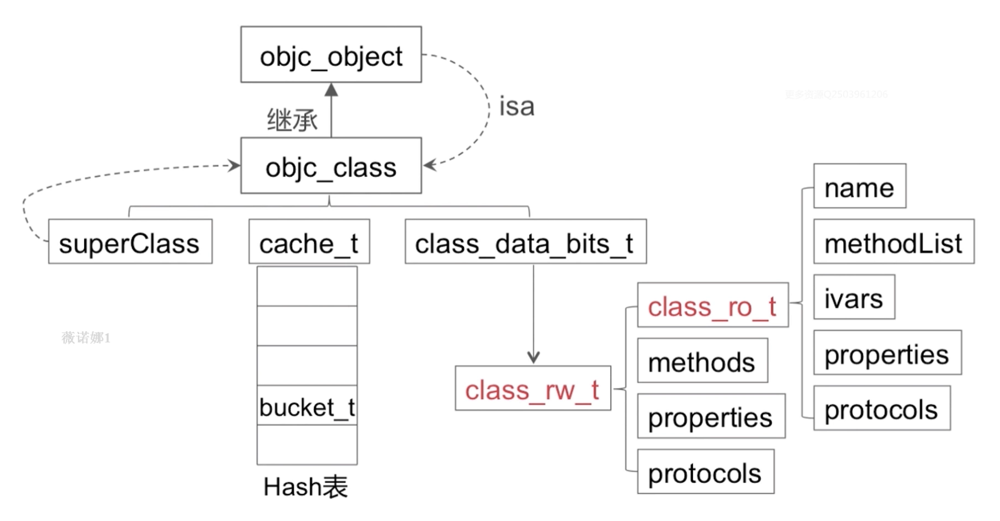

[TOC]

# runtime相关问题

> * 调试好可运行的源码 [objc-runtime](https://github.com/colourful987/2020-Read-Record/tree/master/Annotated%20source%20code/objc4-750)，官网找 [objc4](https://opensource.apple.com/tarballs/objc4/)；
>


## 结构模型

### 1. 介绍下runtime的内存模型（isa、对象、类、metaclass、结构体的存储信息等）


### 2. 为什么要设计metaclass


### 3. `class_copyIvarList` & `class_copyPropertyList`区别

`class_copyIvarList` 获取类对象中的所有实例变量信息，从 `class_ro_t` 中获取：

```objective-c
Ivar *
class_copyIvarList(Class cls, unsigned int *outCount)
{
    const ivar_list_t *ivars;
    Ivar *result = nil;
    unsigned int count = 0;

    if (!cls) {
        if (outCount) *outCount = 0;
        return nil;
    }

    mutex_locker_t lock(runtimeLock);

    assert(cls->isRealized());
    
    if ((ivars = cls->data()->ro->ivars)  &&  ivars->count) {
        result = (Ivar *)malloc((ivars->count+1) * sizeof(Ivar));
        
        for (auto& ivar : *ivars) {
            if (!ivar.offset) continue;  // anonymous bitfield
            result[count++] = &ivar;
        }
        result[count] = nil;
    }
    
    if (outCount) *outCount = count;
    return result;
}
```

`class_copyPropertyList` 获取类对象中的属性信息， `class_rw_t` 的 `properties`，先后输出了 category / extension/ baseClass 的属性，而且仅输出当前的类的属性信息，而不会向上去找 superClass 中定义的属性。

```objective-c
objc_property_t *
class_copyPropertyList(Class cls, unsigned int *outCount)
{
    if (!cls) {
        if (outCount) *outCount = 0;
        return nil;
    }

    mutex_locker_t lock(runtimeLock);

    checkIsKnownClass(cls);
    assert(cls->isRealized());
    
    auto rw = cls->data();

    property_t **result = nil;
    unsigned int count = rw->properties.count();
    if (count > 0) {
        result = (property_t **)malloc((count + 1) * sizeof(property_t *));

        count = 0;
        for (auto& prop : rw->properties) {
            result[count++] = &prop;
        }
        result[count] = nil;
    }

    if (outCount) *outCount = count;
    return (objc_property_t *)result;
}
```

> Q1: `class_ro_t` 中的 `baseProperties` 呢？
>
> Q2: `class_rw_t` 中的 `properties` 包含了所有属性，那何时注入进去的呢？ 答案见 5.

### 4. `class_rw_t` 和 `class_ro_t` 的区别



测试发现，`class_rw_t` 中的 `properties` 属性按顺序包含分类/扩展/基类中的属性。

```objective-c
struct class_ro_t {
    uint32_t flags;
    uint32_t instanceStart;
    uint32_t instanceSize;
#ifdef __LP64__
    uint32_t reserved;
#endif

    const uint8_t * ivarLayout;
    
    const char * name;
    method_list_t * baseMethodList;
    protocol_list_t * baseProtocols;
    const ivar_list_t * ivars;

    const uint8_t * weakIvarLayout;
    property_list_t *baseProperties;

    method_list_t *baseMethods() const {
        return baseMethodList;
    }
};

struct class_rw_t {
    // Be warned that Symbolication knows the layout of this structure.
    uint32_t flags;
    uint32_t version;

    const class_ro_t *ro;

    method_array_t methods;
    property_array_t properties;
    protocol_array_t protocols;

    Class firstSubclass;
    Class nextSiblingClass;

    char *demangledName;

#if SUPPORT_INDEXED_ISA
    uint32_t index;
#endif
}
```


### 5. `category`如何被加载的,两个category的`load`方法的加载顺序，两个category的同名方法的加载顺序

`... -> realizeClass -> methodizeClass(用于Attach categories)-> attachCategories` 关键就是在 methodizeClass 方法实现中

```objective-c
static void methodizeClass(Class cls)
{
    runtimeLock.assertLocked();

    bool isMeta = cls->isMetaClass();
    auto rw = cls->data();
    auto ro = rw->ro;
  	
  	// =======================================
		// 省略.....
  	// =======================================
  
    property_list_t *proplist = ro->baseProperties;
    if (proplist) {
        rw->properties.attachLists(&proplist, 1);
    }

  	// =======================================
		// 省略.....
  	// =======================================

    // Attach categories.
    category_list *cats = unattachedCategoriesForClass(cls, true /*realizing*/);
    attachCategories(cls, cats, false /*don't flush caches*/);

  	// =======================================
		// 省略.....
  	// =======================================
    
    if (cats) free(cats);

}
```

上面代码能确定 baseProperties 在前，category 在后，但决定顺序的是 `rw->properties.attachLists` 这个方法：

```objective-c
property_list_t *proplist = ro->baseProperties;
if (proplist) {
  rw->properties.attachLists(&proplist, 1);
}

/// category 被附加进去
void attachLists(List* const * addedLists, uint32_t addedCount) {
        if (addedCount == 0) return;

        if (hasArray()) {
            // many lists -> many lists
            uint32_t oldCount = array()->count;
            uint32_t newCount = oldCount + addedCount;
            setArray((array_t *)realloc(array(), array_t::byteSize(newCount)));
            array()->count = newCount;
            
            // 将旧内容移动偏移量 addedCount 然后将 addedLists copy 到起始位置
          	/*
          		struct array_t {
        				uint32_t count;
        				List* lists[0];
    					};
          	*/
            memmove(array()->lists + addedCount, array()->lists, 
                    oldCount * sizeof(array()->lists[0]));
            memcpy(array()->lists, addedLists, 
                   addedCount * sizeof(array()->lists[0]));
        }
        else if (!list  &&  addedCount == 1) {
            // 0 lists -> 1 list
            list = addedLists[0];
        } 
        else {
            // 1 list -> many lists
            List* oldList = list;
            uint32_t oldCount = oldList ? 1 : 0;
            uint32_t newCount = oldCount + addedCount;
            setArray((array_t *)malloc(array_t::byteSize(newCount)));
            array()->count = newCount;
            if (oldList) array()->lists[addedCount] = oldList;
            memcpy(array()->lists, addedLists, 
                   addedCount * sizeof(array()->lists[0]));
        }
    }
```

所以 category 的属性总是在前面的，baseClass的属性被往后偏移了。

>  Q1：那么多个 category 的顺序呢？答案见6

2020/03/18 补充下应用程序 image 镜像加载到内存中时， Category 解析的过程，注意下面的 `while(i--)` 这里倒叙将 category 中的协议 方法 属性添加到了 `rw = cls->data()` 中的 `methods/properties/protocols` 中。

```objective-c
static void 
attachCategories(Class cls, category_list *cats, bool flush_caches)
{
    if (!cats) return;
    if (PrintReplacedMethods) printReplacements(cls, cats);

    bool isMeta = cls->isMetaClass();

    // fixme rearrange to remove these intermediate allocations
    method_list_t **mlists = (method_list_t **)
        malloc(cats->count * sizeof(*mlists));
    property_list_t **proplists = (property_list_t **)
        malloc(cats->count * sizeof(*proplists));
    protocol_list_t **protolists = (protocol_list_t **)
        malloc(cats->count * sizeof(*protolists));

    // Count backwards through cats to get newest categories first
    int mcount = 0;
    int propcount = 0;
    int protocount = 0;
    int i = cats->count;
    bool fromBundle = NO;
    while (i--) {
        auto& entry = cats->list[i];

        method_list_t *mlist = entry.cat->methodsForMeta(isMeta);
        if (mlist) {
            mlists[mcount++] = mlist;
            fromBundle |= entry.hi->isBundle();
        }

        property_list_t *proplist = 
            entry.cat->propertiesForMeta(isMeta, entry.hi);
        if (proplist) {
            proplists[propcount++] = proplist;
        }

        protocol_list_t *protolist = entry.cat->protocols;
        if (protolist) {
            protolists[protocount++] = protolist;
        }
    }
    auto rw = cls->data();
		
  	// 注意下面的代码，上面采用倒叙遍历方式，所以后编译的 category 会先add到数组的前部
    prepareMethodLists(cls, mlists, mcount, NO, fromBundle);
    rw->methods.attachLists(mlists, mcount);
    free(mlists);
    if (flush_caches  &&  mcount > 0) flushCaches(cls);

    rw->properties.attachLists(proplists, propcount);
    free(proplists);

    rw->protocols.attachLists(protolists, protocount);
    free(protolists);
}
```


### 6. `category` & `extension`区别，能给NSObject添加Extension吗，结果如何

category:

* 运行时添加分类属性/协议/方法
* 分类添加的方法会“覆盖”原类方法，因为方法查找的话是从头至尾，一旦查找到了就停止了
* 同名分类方法谁生效取决于编译顺序，image 读取的信息是倒叙的，所以编译越靠后的越先读入
* 名字相同的分类会引起编译报错；

extension:

* 编译时决议
* 只以声明的形式存在，多数情况下就存在于 .m 文件中；
* 不能为系统类添加扩展

### 7. 消息转发机制，消息转发机制和其他语言的消息机制优劣对比
### 8. 在方法调用的时候，`方法查询-> 动态解析-> 消息转发` 之前做了什么
### 9. `IMP`、`SEL`、`Method`的区别和使用场景

三者的定义：

```objective-c
typedef struct method_t *Method;

using MethodListIMP = IMP;

struct method_t {
    SEL name;
    const char *types;
    MethodListIMP imp;
};
```

Method 同样是个对象，封装了方法名和实现，关于 [Type Encodings](https://developer.apple.com/library/archive/documentation/Cocoa/Conceptual/ObjCRuntimeGuide/Articles/ocrtTypeEncodings.html#//apple_ref/doc/uid/TP40008048-CH100-SW1)。

| Code               | Meaning                                                      |
| :----------------- | :----------------------------------------------------------- |
| `c`                | A `char`                                                     |
| `i`                | An `int`                                                     |
| `s`                | A `short`                                                    |
| `l`                | A `long``l` is treated as a 32-bit quantity on 64-bit programs. |
| `q`                | A `long long`                                                |
| `C`                | An `unsigned char`                                           |
| `I`                | An `unsigned int`                                            |
| `S`                | An `unsigned short`                                          |
| `L`                | An `unsigned long`                                           |
| `Q`                | An `unsigned long long`                                      |
| `f`                | A `float`                                                    |
| `d`                | A `double`                                                   |
| `B`                | A C++ `bool` or a C99 `_Bool`                                |
| `v`                | A `void`                                                     |
| `*`                | A character string (`char *`)                                |
| `@`                | An object (whether statically typed or typed `id`)           |
| `#`                | A class object (`Class`)                                     |
| `:`                | A method selector (`SEL`)                                    |
| [*array type*]     | An array                                                     |
| {*name=type...*}   | A structure                                                  |
| (*name*=*type...*) | A union                                                      |
| `b`num             | A bit field of *num* bits                                    |
| `^`type            | A pointer to *type*                                          |
| `?`                | An unknown type (among other things, this code is used for function pointers) |

 `-(void)hello:(NSString *)name` encode 下就是 `v@:@`。

### 10. `load`、`initialize`方法的区别什么？在继承关系中他们有什么区别

load 方法调用时机，而且只调用当前类本身，不会调用superClass 的 `+load` 方法：

```objective-c
void
load_images(const char *path __unused, const struct mach_header *mh)
{
    // Return without taking locks if there are no +load methods here.
    if (!hasLoadMethods((const headerType *)mh)) return;

    recursive_mutex_locker_t lock(loadMethodLock);

    // Discover load methods
    {
        mutex_locker_t lock2(runtimeLock);
        prepare_load_methods((const headerType *)mh);
    }

    // Call +load methods (without runtimeLock - re-entrant)
    call_load_methods();
}

void call_load_methods(void)
{
    static bool loading = NO;
    bool more_categories;

    loadMethodLock.assertLocked();

    // Re-entrant calls do nothing; the outermost call will finish the job.
    if (loading) return;
    loading = YES;

    void *pool = objc_autoreleasePoolPush();

    do {
        // 1. Repeatedly call class +loads until there aren't any more
        while (loadable_classes_used > 0) {
            call_class_loads();
        }

        // 2. Call category +loads ONCE
        more_categories = call_category_loads();

        // 3. Run more +loads if there are classes OR more untried categories
    } while (loadable_classes_used > 0  ||  more_categories);

    objc_autoreleasePoolPop(pool);

    loading = NO;
}
```

`+initialize` 实现

```objective-c
void _class_initialize(Class cls)
{
    assert(!cls->isMetaClass());

    Class supercls;
    bool reallyInitialize = NO;

    // Make sure super is done initializing BEFORE beginning to initialize cls.
    // See note about deadlock above.
    supercls = cls->superclass;
    if (supercls  &&  !supercls->isInitialized()) {
        _class_initialize(supercls);
    }
    
    // Try to atomically set CLS_INITIALIZING.
    {
        monitor_locker_t lock(classInitLock);
        if (!cls->isInitialized() && !cls->isInitializing()) {
            cls->setInitializing();
            reallyInitialize = YES;
        }
    }
    
    if (reallyInitialize) {
        // We successfully set the CLS_INITIALIZING bit. Initialize the class.
        
        // Record that we're initializing this class so we can message it.
        _setThisThreadIsInitializingClass(cls);

        if (MultithreadedForkChild) {
            // LOL JK we don't really call +initialize methods after fork().
            performForkChildInitialize(cls, supercls);
            return;
        }
        
        // Send the +initialize message.
        // Note that +initialize is sent to the superclass (again) if 
        // this class doesn't implement +initialize. 2157218
        if (PrintInitializing) {
            _objc_inform("INITIALIZE: thread %p: calling +[%s initialize]",
                         pthread_self(), cls->nameForLogging());
        }

        // Exceptions: A +initialize call that throws an exception 
        // is deemed to be a complete and successful +initialize.
        //
        // Only __OBJC2__ adds these handlers. !__OBJC2__ has a
        // bootstrapping problem of this versus CF's call to
        // objc_exception_set_functions().
#if __OBJC2__
        @try
#endif
        {
            callInitialize(cls);

            if (PrintInitializing) {
                _objc_inform("INITIALIZE: thread %p: finished +[%s initialize]",
                             pthread_self(), cls->nameForLogging());
            }
        }
#if __OBJC2__
        @catch (...) {
            if (PrintInitializing) {
                _objc_inform("INITIALIZE: thread %p: +[%s initialize] "
                             "threw an exception",
                             pthread_self(), cls->nameForLogging());
            }
            @throw;
        }
        @finally
#endif
        {
            // Done initializing.
            lockAndFinishInitializing(cls, supercls);
        }
        return;
    }
    
    else if (cls->isInitializing()) {
        // We couldn't set INITIALIZING because INITIALIZING was already set.
        // If this thread set it earlier, continue normally.
        // If some other thread set it, block until initialize is done.
        // It's ok if INITIALIZING changes to INITIALIZED while we're here, 
        //   because we safely check for INITIALIZED inside the lock 
        //   before blocking.
        if (_thisThreadIsInitializingClass(cls)) {
            return;
        } else if (!MultithreadedForkChild) {
            waitForInitializeToComplete(cls);
            return;
        } else {
            // We're on the child side of fork(), facing a class that
            // was initializing by some other thread when fork() was called.
            _setThisThreadIsInitializingClass(cls);
            performForkChildInitialize(cls, supercls);
        }
    }
    
    else if (cls->isInitialized()) {
        // Set CLS_INITIALIZING failed because someone else already 
        //   initialized the class. Continue normally.
        // NOTE this check must come AFTER the ISINITIALIZING case.
        // Otherwise: Another thread is initializing this class. ISINITIALIZED 
        //   is false. Skip this clause. Then the other thread finishes 
        //   initialization and sets INITIALIZING=no and INITIALIZED=yes. 
        //   Skip the ISINITIALIZING clause. Die horribly.
        return;
    }
    
    else {
        // We shouldn't be here. 
        _objc_fatal("thread-safe class init in objc runtime is buggy!");
    }
}

void callInitialize(Class cls)
{
    ((void(*)(Class, SEL))objc_msgSend)(cls, SEL_initialize);
    asm("");
}
```

注意看上面的调用了 ` callInitialize(cls)` 然后又调用了 `lockAndFinishInitializing(cls, supercls)`。 

> 摘自[iOS App冷启动治理](https://juejin.im/post/5c0a17d6e51d4570cf60d102?utm_source=gold_browser_extension) 一文中对 Dyld 在各阶段所做的事情：

| 阶段         | 工作                                                         |
| ------------ | ------------------------------------------------------------ |
| 加载动态库   | Dyld从主执行文件的header获取到需要加载的所依赖动态库列表，然后它需要找到每个 dylib，而应用所依赖的 dylib 文件可能会再依赖其他 dylib，所以所需要加载的是动态库列表一个递归依赖的集合 |
| Rebase和Bind | - Rebase在Image内部调整指针的指向。在过去，会把动态库加载到指定地址，所有指针和数据对于代码都是对的，而现在地址空间布局是随机化，所以需要在原来的地址根据随机的偏移量做一下修正 - Bind是把指针正确地指向Image外部的内容。这些指向外部的指针被符号(symbol)名称绑定，dyld需要去符号表里查找，找到symbol对应的实现 |
| Objc setup   | - 注册Objc类 (class registration) - 把category的定义插入方法列表 (category registration) - 保证每一个selector唯一 (selector uniquing) |
| Initializers | - Objc的+load()函数 - C++的构造函数属性函数 - 非基本类型的C++静态全局变量的创建(通常是类或结构体) |

最后 dyld 会调用 main() 函数，main() 会调用 UIApplicationMain()，before main()的过程也就此完成。

### 11. 说说消息转发机制的优劣

## 内存管理

1. `weak`的实现原理？`SideTable`的结构是什么样的
2. 关联对象的应用？系统如何实现关联对象的
3. 关联对象的如何进行内存管理的？关联对象如何实现weak属性
4. `Autoreleasepool`的原理？所使用的的数据结构是什么
5. `ARC`的实现原理？`ARC`下对`retain & release`做了哪些优化
6. `ARC`下哪些情况会造成内存泄漏

## 其他

1. `Method Swizzle`注意事项
2. 属性修饰符`atomic`的内部实现是怎么样的?能保证线程安全吗
3. iOS 中内省的几个方法有哪些？内部实现原理是什么
4. `class、objc_getClass、object_getclass` 方法有什么区别?

# NSNotification相关

认真研读、你可以在这里找到答案[轻松过面：一文全解iOS通知机制(经典收藏)](https://juejin.im/post/5e5fc16df265da575155723b)

1. 实现原理（结构设计、通知如何存储的、`name&observer&SEL`之间的关系等）
2. 通知的发送时同步的，还是异步的
3. `NSNotificationCenter`接受消息和发送消息是在一个线程里吗？如何异步发送消息
4. `NSNotificationQueue`是异步还是同步发送？在哪个线程响应
5. `NSNotificationQueue`和`runloop`的关系
6. 如何保证通知接收的线程在主线程
7. 页面销毁时不移除通知会崩溃吗
8. 多次添加同一个通知会是什么结果？多次移除通知呢
9. 下面的方式能接收到通知吗？为什么

```
// 发送通知
[[NSNotificationCenter defaultCenter] addObserver:self selector:@selector(handleNotification:) name:@"TestNotification" object:@1];
// 接收通知
[NSNotificationCenter.defaultCenter postNotificationName:@"TestNotification" object:nil];
复制代码
```

# Runloop & KVO

## runloop

`runloop`对于一个标准的iOS开发来说都不陌生，应该说熟悉`runloop`是标配，下面就随便列几个典型问题吧

1. app如何接收到触摸事件的
2. 为什么只有主线程的`runloop`是开启的
3. 为什么只在主线程刷新UI
4. `PerformSelector`和`runloop`的关系
5. 如何使线程保活

## KVO

同`runloop`一样，这也是标配的知识点了，同样列出几个典型问题

1. 实现原理
2. 如何手动关闭kvo
3. 通过KVC修改属性会触发KVO么
4. 哪些情况下使用kvo会崩溃，怎么防护崩溃
5. kvo的优缺点

# Block

1. `block`的内部实现，结构体是什么样的
2. block是类吗，有哪些类型
3. 一个`int`变量被 `__block` 修饰与否的区别？block的变量截获
4. `block`在修改`NSMutableArray`，需不需要添加`__block`
5. 怎么进行内存管理的
6. `block`可以用`strong`修饰吗
7. 解决循环引用时为什么要用`__strong、__weak`修饰
8. `block`发生`copy`时机
9. `Block`访问对象类型的`auto变量`时，在`ARC和MRC`下有什么区别

# 多线程

主要以GCD为主

1. `iOS`开发中有多少类型的线程？分别对比
2. `GCD`有哪些队列，默认提供哪些队列
3. `GCD`有哪些方法api
4. `GCD`主线程 & 主队列的关系
5. 如何实现同步，有多少方式就说多少
6. `dispatch_once`实现原理
7. 什么情况下会死锁
8. 有哪些类型的线程锁，分别介绍下作用和使用场景
9. `NSOperationQueue`中的`maxConcurrentOperationCount`默认值
10. `NSTimer、CADisplayLink、dispatch_source_t` 的优劣

# 视图&图像相关

1. `AutoLayout`的原理，性能如何
2. `UIView & CALayer`的区别
3. 事件响应链
4. `drawrect & layoutsubviews`调用时机
5. UI的刷新原理
6. 隐式动画 & 显示动画区别
7. 什么是离屏渲染
8. imageName & imageWithContentsOfFile区别
9. 多个相同的图片，会重复加载吗
10. 图片是什么时候解码的，如何优化
11. 图片渲染怎么优化
12. 如果GPU的刷新率超过了iOS屏幕60Hz刷新率是什么现象，怎么解决

# 性能优化

1. 如何做启动优化，如何监控
2. 如何做卡顿优化，如何监控
3. 如何做耗电优化，如何监控
4. 如何做网络优化，如何监控

# 开发证书

1. 苹果使用证书的目的是什么
2. AppStore安装app时的认证流程
3. 开发者怎么在debug模式下把app安装到设备呢

# 架构设计

## 典型源码的学习

只是列出一些iOS比较核心的开源库，这些库包含了很多高质量的思想，源码学习的时候一定要关注每个框架解决的核心问题是什么，还有它们的优缺点，这样才能算真正理解和吸收

1. AFN
2. SDWebImage
3. JSPatch、Aspects(虽然一个不可用、另一个不维护，但是这两个库都很精炼巧妙，很适合学习)
4. Weex/RN, 笔者认为这种前端和客户端紧密联系的库是必须要知道其原理的
5. CTMediator、其他router库，这些都是常见的路由库，开发中基本上都会用到
6. 请`圈友`们在评论下面补充吧

## 架构设计

1. 手动埋点、自动化埋点、可视化埋点
2. `MVC、MVP、MVVM`设计模式
3. 常见的设计模式
4. 单例的弊端
5. 常见的路由方案，以及优缺点对比
6. 如果保证项目的稳定性
7. 设计一个图片缓存框架(LRU)
8. 如何设计一个`git diff`
9. 设计一个线程池？画出你的架构图
10. 你的app架构是什么，有什么优缺点、为什么这么做、怎么改进

# 其他问题

1. `PerformSelector & NSInvocation`优劣对比
2. `oc`怎么实现多继承？怎么面向切面（可以参考[Aspects深度解析-iOS面向切面编程](https://juejin.im/post/5e13c4366fb9a047f42e6406)）
3. 哪些`bug`会导致崩溃，如何防护崩溃
4. 怎么监控崩溃
5. `app`的启动过程（考察LLVM编译过程、静态链接、动态链接、runtime初始化）
6. 沙盒目录的每个文件夹划分的作用
7. 简述下`match-o`文件结构

# 系统基础知识

1. 进程和线程的区别
2. `HTTPS`的握手过程
3. 什么是`中间人攻击`？怎么预防
4. `TCP`的握手过程？为什么进行三次握手，四次挥手
5. `堆和栈`区的区别？谁的占用内存空间大
6. 加密算法：`对称加密算法和非对称加密算法`区别
7. 常见的`对称加密和非对称加密`算法有哪些
8. `MD5、Sha1、Sha256`区别
9. `charles`抓包过程？不使用`charles`，`4G`网络如何抓包

# 数据结构与算法

对于移动开发者来说，一般不会遇到非常难的算法，大多以数据结构为主，笔者列出一些必会的算法，当然有时间了可以去[LeetCode](https://leetcode.com/)上刷刷题

1. 八大排序算法
2. 栈&队列
3. 字符串处理
4. 链表
5. 二叉树相关操作
6. 深搜广搜
7. 基本的动态规划题、贪心算法、二分查找
